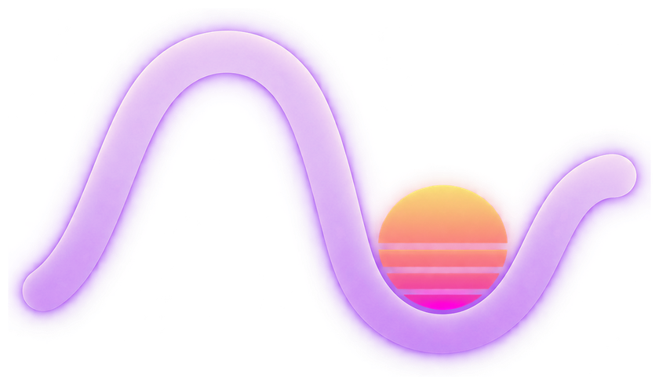

<p align="center">
  
</p>

<h1 align="center">Retrograd</h1>

<p align="center">
  Train LoRA adapters on GGUF models, from SFT to agentic GRPO.
</p>

<p align="center">
  <a href="https://github.com/tterrasson/retrograd/actions/workflows/ci.yml"></a>
  <a href="LICENSE"></a>
</p>

Retrograd is built on a `llama.cpp`/`ggml` fork and driven by a Rust CLI. The
GGUF base model is loaded as is, with no conversion step: its tensors stay
frozen while `ggml` autograd trains the adapter in memory. The adapter is
exported as a standalone GGUF in the standard `llama.cpp` LoRA format: a stock
`llama.cpp` loads it with `--lora`, without the fork.

- **Algorithms**: SFT, PPO, GRPO, distillation from a teacher model, and
  multi-turn agentic GRPO.
- **Devices**: CPU everywhere, and GPU through Metal (macOS), Vulkan, or CUDA.
- **Quantizations**: the base model can be F16 or quantized - Q4_0/Q4_1,
  Q5_0/Q5_1, Q8_0, the K-quants (Q2_K to Q6_K), the i-quants (IQ2_XXS to
  IQ4_XS), and MXFP4, on every backend. The lowest-bit formats (Q1_0, Q2_0,
  IQ1_S, IQ1_M) and NVFP4 train on CPU, CUDA, and Vulkan, not on Metal.
- **Interfaces**: the CLI, the `retrograd` Rust crate, and Python bindings.

---

## Build

The `llama.cpp` fork is a git submodule. Clone with it, then build with Cargo:

```sh
git clone --recurse-submodules https://github.com/tterrasson/retrograd.git
cd retrograd
cargo build --release
```

In a clone made without `--recurse-submodules`, run `scripts/setup-llama-cpp.sh`
(or `git submodule update --init`) before building.

The build enables the GPU backend that matches the platform (Metal on macOS).
Select backends at build time with Cargo features (CPU is always included):

```sh
cargo build --release                     # platform default: Metal on macOS, CPU elsewhere
cargo build --features vulkan --release   # Vulkan instead of the default; needs the Vulkan SDK
cargo build --features cuda --release     # needs the CUDA Toolkit
```

Per-backend requirements and options are in
[Build variants](https://tterrasson.github.io/retrograd/reference/builds); what each backend supports is in the
[support matrix](https://tterrasson.github.io/retrograd/engineering/SUPPORT).

## Quick start

The fastest check that training works is the tiny smoke run: a rank-1 LoRA
adapter trained for one epoch on a few lines of text. Point it at a GGUF model
with `--model`:

```sh
cargo run --release -q -- train examples/smoke_tiny_sft.toml --model MODEL.gguf
```

The example is configured for the CPU; add `--device gpu` to train on the
compiled GPU backend.

Without a model at hand, drop `--model`: the configuration then uses the CPU
test fixture, fetched and checksum-verified once:

```sh
scripts/fetch-cpu-fixture.sh
cargo run --release -q -- train examples/smoke_tiny_sft.toml
```

The example sets `run.verbose = true`. A successful LoRA-only run reports
`base_trainable_tensors: 0`, a `lora_trainable_tensors` greater than 0, and a
finite `train_loss` on the final `done` line. The export step reloads the
adapter and fails the run if the written GGUF is invalid.

`examples/smoke_tiny_ppo.toml` and `examples/smoke_tiny_grpo.toml` run the same
check for the rollout algorithms, on eight addition questions scored by
`examples/smoke_rl_reward.py`. They take the same `--model MODEL.gguf`.

For a fuller GRPO example, the [register machine](examples/register_machine/README.md)
trains a small model to write programs, with an exact reward and held-out evaluation.

The [quickstart](https://tterrasson.github.io/retrograd/getting-started/quickstart) walks through a first real
run: a dataset, a configuration, training, and testing the adapter.

## Workflow

The CLI follows one progression. Inspect a model, check the training graph,
train, then evaluate:

```sh
retrograd inspect --model base.gguf              # capability report and LoRA targets
retrograd preflight --model base.gguf --strict   # ops the device cannot run
retrograd train run.toml                         # --resume continues a stopped run
retrograd bench run.toml --adapter adapter.gguf  # base against adapter, same examples
retrograd chat run.toml --compare                # base and adapter, turn by turn
```

Every command and flag is in the [CLI reference](https://tterrasson.github.io/retrograd/reference/cli), and
every configuration key in the
[configuration reference](https://tterrasson.github.io/retrograd/reference/configuration).

## Documentation

The documentation is published at <https://tterrasson.github.io/retrograd/>.
It is a VitePress site under [`docs/`](docs/)
(`cd docs && bun install && bun run docs:dev`):

- **Getting started**: [quickstart](https://tterrasson.github.io/retrograd/getting-started/quickstart),
  [datasets and paths](https://tterrasson.github.io/retrograd/getting-started/datasets).
- **Training**: [SFT](https://tterrasson.github.io/retrograd/training/sft), [PPO](https://tterrasson.github.io/retrograd/training/ppo),
  [GRPO](https://tterrasson.github.io/retrograd/training/grpo), [distillation](https://tterrasson.github.io/retrograd/training/distill).
- **Reference**: [configuration](https://tterrasson.github.io/retrograd/reference/configuration),
  [CLI](https://tterrasson.github.io/retrograd/reference/cli), [build variants](https://tterrasson.github.io/retrograd/reference/builds).
- **Operations**: [checkpoints and monitoring](https://tterrasson.github.io/retrograd/operations/checkpoints),
  [profiling](https://tterrasson.github.io/retrograd/operations/profiling).
- **Engineering**: [overview](https://tterrasson.github.io/retrograd/engineering/), covering contribution
  rules, test lanes, RIR kernels, backend status and implementation notes.

## Libraries

An independent `uv` project in [python/](python/) wraps the Rust `Trainer`
through a small PyO3 extension; see [python/README.md](python/README.md). The
Rust CLI and C++ runtime do not depend on Python.

The Rust API is the `retrograd` crate:

```rust
use retrograd::{LoraConfig, Result, TrainConfig, Trainer};

fn main() -> Result<()> {
    let mut trainer = Trainer::new("base.gguf", TrainConfig::default())?;
    trainer.create_lora(&LoraConfig::qv(8, 16.0))?;
    let tokens = trainer.tokenize_text("training text goes here")?;
    let metrics = trainer.train_tokens(&tokens)?;
    trainer.save_lora("adapter.gguf")?;
    println!("loss={}", metrics.train_loss);
    Ok(())
}
```

## Tests

Use the lane scripts rather than a raw `cargo test` or `pytest`: they select the
backends, fixtures and build directories a change needs.

```sh
scripts/test-fast-rust.sh     # every change
scripts/test-fast-python.sh   # every change touching Python or the configuration
```

[Tests and validation](https://tterrasson.github.io/retrograd/engineering/tests/notice) says which lane to run
for a given change, and [the test lanes in detail](https://tterrasson.github.io/retrograd/engineering/tests/lanes)
what each one covers.

## Contributing

Start with [the contribution principles](https://tterrasson.github.io/retrograd/engineering/contributing). The
`llama.cpp` fork is vendored as a git submodule at
`crates/retrograd-ffi/runtime/vendor/llama.cpp`; syncing and publishing it is
described in [the fork workflow](https://tterrasson.github.io/retrograd/engineering/LLAMA_CPP_FORK_WORKFLOW).

## License

Retrograd is licensed under the [MIT License](LICENSE). It vendors, as a git
submodule, a fork of `llama.cpp` (which bundles `ggml`), both themselves
MIT-licensed. See [NOTICE](NOTICE) for the third-party attribution, and
[the fork's provenance and delta list](crates/retrograd-ffi/runtime/third_party_notes/LLAMA_CPP_SOURCE.md).
